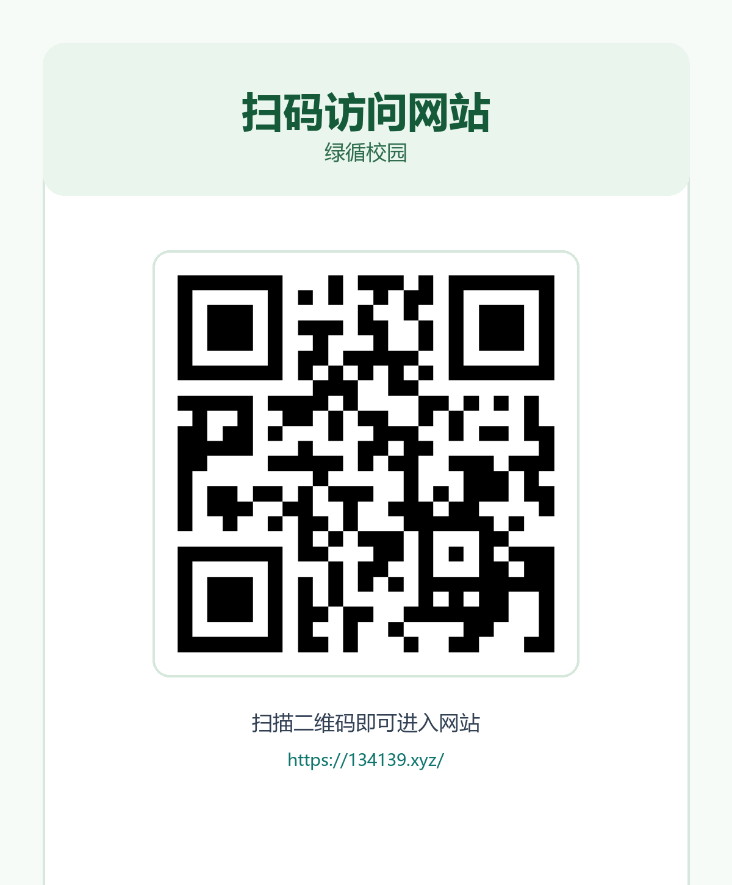

# 网站使用文档（用户版）

## 1. 文档说明

本手册面向普通使用者，帮助你完成注册登录、物品提交、查看进度、公示申领和积分兑换等操作。

网站地址：`https://134139.xyz/`

网站适用场景：

- 想把仍可使用的电子设备捐赠给校内有需要的人
- 想把损坏或老旧设备投放到固定回收点
- 想预约管理员上门回收电子废弃物

## 2. 登录与注册

### 2.1 注册账号

1. 打开网站首页
2. 进入“登录 / 注册”
3. 切换到“注册账号”
4. 输入手机号，点击“获取验证码”
5. 填写短信验证码、密码、昵称和所属校区
6. 提交后即可自动登录

### 2.2 登录账号

1. 打开“登录 / 注册”页面
2. 输入手机号和密码
3. 点击“登录”

## 3. 提交物品

登录后进入“提交物品”页面，填写以下信息：

- 物品名称
- 类别
- 品牌 / 型号
- 成色 / 状态
- 文字说明
- 实物图片
- 处理方式

图片要求：

- 支持 JPG、PNG、WebP、GIF
- 建议上传清晰正面图
- 文件大小不超过 5MB

## 4. 三种处理方式说明

### 4.1 捐赠

适用情况：

- 设备仍可继续使用
- 希望转给校内有需要的同学

提交时需要补充：

- 捐赠说明
- 希望优先面向的人群（可选）

审核通过后：

- 物品会进入公示大厅
- 你会收到站内通知
- 系统发放 5 积分

### 4.2 投放固定回收点

适用情况：

- 设备损坏或老旧
- 可以自行携带到回收点投放

提交时需要补充：

- 校区
- 园区
- 具体点位
- 预计投放时间

审核通过后：

- 记录进入固定回收点流程
- 你会收到站内通知
- 系统发放 5 积分

### 4.3 上门回收

适用情况：

- 有电子废弃物需要预约回收
- 希望由管理员按预约时段上门处理

提交时需要补充：

- 宿舍楼栋
- 楼层（1-13 层）
- 房间号（示例：1105/1209）
- 可预约时间段（周一19:00-22:00、周三19:00-22:00、周六9:00-11:00、周天14:00-18:00）

审核通过后：

- 记录进入“待上门回收”
- 管理员会按预约时段联系或上门处理
- 回收完成后系统再发放 5 积分

## 5. 查看物品处理进度

进入“个人中心”后，你可以看到：

- 我的提交
- 我的申请
- 站内通知
- 兑换记录
- 当前积分

常见状态说明：

- 待审核：管理员尚未处理
- 公示中：捐赠物品已对外展示
- 待投放：固定回收点记录已审核通过
- 待上门回收：管理员已确认上门回收
- 已匹配：捐赠物品已有通过审核的申领人
- 已完成：本条流程已结束
- 已驳回：管理员未通过审核

## 6. 公示大厅申领

如果你想申请别人捐赠的设备：

1. 进入“公示大厅”
2. 打开感兴趣的物品详情
3. 填写申请原因 / 用途说明
4. 提交申请
5. 等待管理员审核

注意事项：

- 只能申请“公示中”的捐赠物品
- 固定回收点和上门回收记录不开放申领
- 公示页不会显示提交者完整手机号

## 7. 积分与兑换

### 7.1 如何获得积分

- 捐赠记录审核通过后获得 5 积分
- 固定回收点记录审核通过后获得 5 积分
- 上门回收记录完成后获得 5 积分

### 7.2 如何兑换商品

1. 进入“积分兑换”
2. 查看商品所需积分和库存
3. 点击“立即兑换”
4. 等待管理员确认发放

兑换规则：

- 提交兑换申请时，积分会先暂扣
- 若管理员驳回，系统会自动退回积分

## 8. 站内通知

平台会通过站内通知告知你：

- 提交物品是否审核通过
- 是否进入公示、回收或上门流程
- 申领申请是否通过
- 积分是否到账
- 积分兑换是否通过

建议登录后优先查看“个人中心 -> 站内通知”。

## 9. 常见问题

### 9.1 提交后多久会有结果

一般要等待管理员审核，具体处理时间以管理员审核进度为准。

### 9.2 为什么我的上门回收没有立刻得分

上门回收是“完成后发分”，不是“审核通过后发分”。

### 9.3 为什么我看不到联系方式

平台默认保护用户隐私，公示页不会公开手机号等敏感信息。

### 9.4 图片上传失败怎么办

请优先检查：

- 图片格式是否支持
- 图片大小是否超过 5MB
- 是否使用了 HEIC/HEIF 图片

## 10. 使用建议

- 文字说明尽量写清功能状态和配件情况
- 可继续使用的设备优先选择“捐赠”
- 可自行携带的损坏设备优先选择“固定回收点”
- 如希望由管理员到宿舍回收，可选择“上门回收”
- 及时关注个人中心通知，避免错过审核结果
